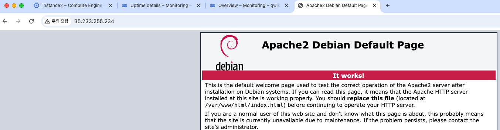
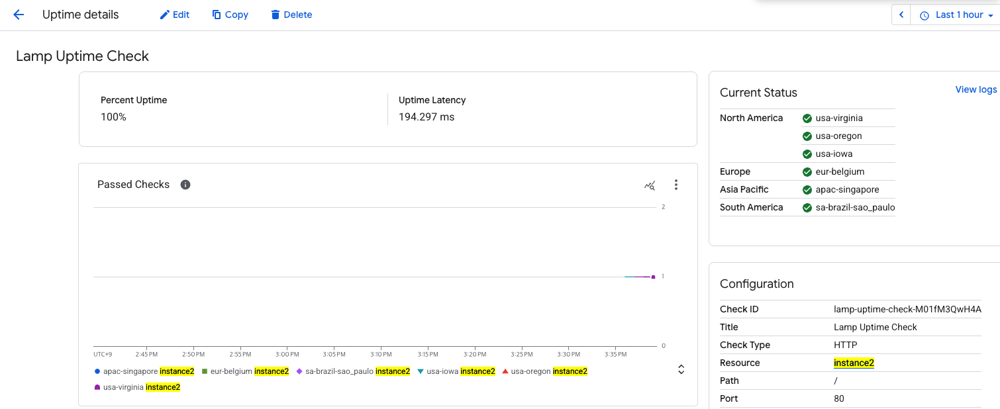
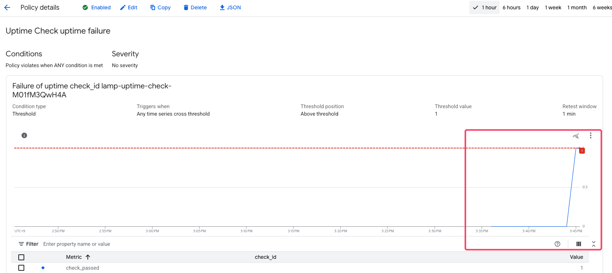
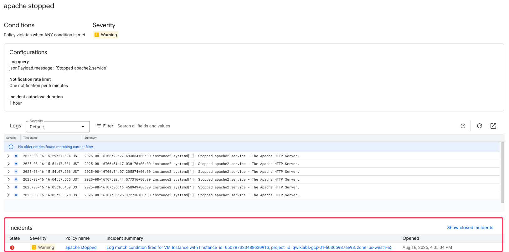
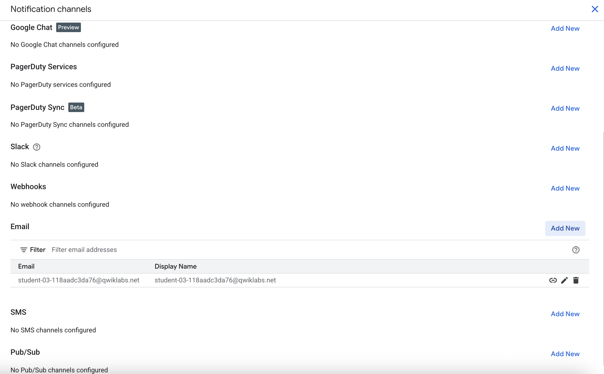
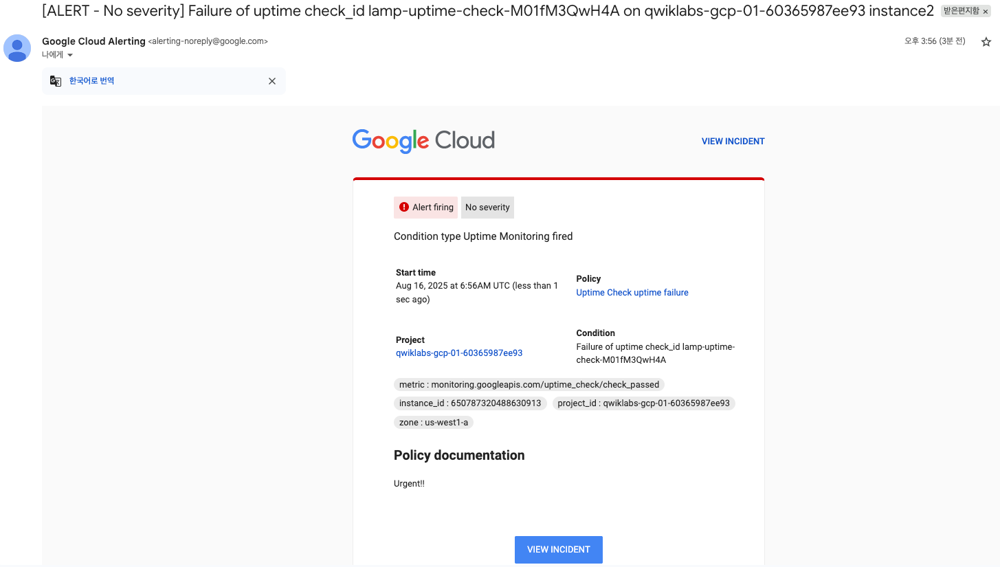
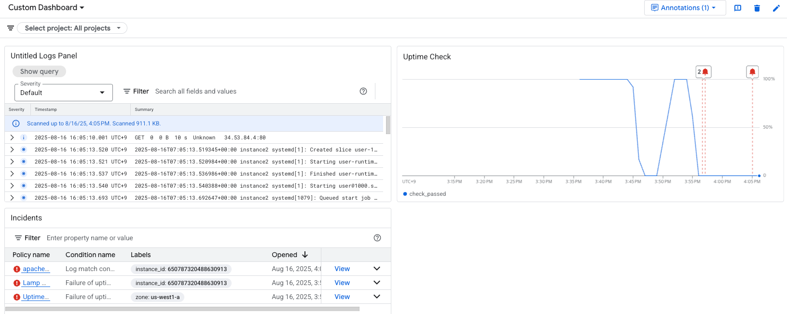
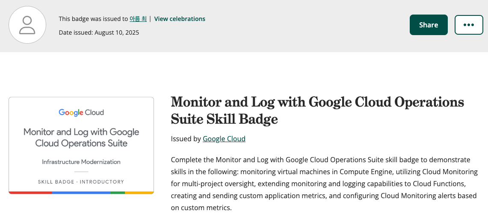

# Week 1 Summary - Google Cloud Observability

## Monitor and Log with Google Cloud Observability
- Google Cloud의 관찰 가능성(Observability) 도구들을 활용하여 애플리케이션과 인프라를 효과적으로 모니터링하고 로깅하는 방법을 학습합니다.

---

## Goal 1: Compute Engine에서 가상 머신 모니터링

### 주요 학습 내용
- **VM 인스턴스 생성 및 실행**
  - Compute Engine을 통한 가상 머신 배포
  - 기본 모니터링 메트릭 확인

- **VM 설정 및 HTTP 트래픽 허용**  
  

  *VM 인스턴스 생성 시 HTTP 트래픽을 허용하는 설정*

- **Apache 웹 서버 실행**
  
  
  
  *VM에서 실행 중인 Apache 웹 서버 화면*

- **Uptime Check 설정**
  - 서비스 가용성 모니터링
  - HTTP/HTTPS, TCP 프로토콜 체크
  - 글로벌 위치에서의 가용성 검증
  
  
  
  
  *Uptime Check 알림 정책 설정 화면*

- **Cloud Monitoring Agent 설치**
  - **Ops Agent 설치**: `curl -sSO https://dl.google.com/cloudagents/add-google-cloud-ops-agent-repo.sh`
  - **구성 요소**:
    - **로깅**: Fluent Bit 기반
    - **모니터링**: Prometheus 기반  
    - **트레이싱**: OpenTelemetry 기반
  
  📚 [참고 문서](https://cloud.google.com/logging/docs/agent/ops-agent/installation?hl=ko)

---

## Goal 2: 다중 프로젝트 감독을 위한 Cloud Monitoring 활용

### 리소스 그룹화 전략
- **모니터링 그룹 생성**
  - 리소스를 논리적으로 그룹화하여 통합 모니터링
  - 그룹 기준: 이름, 태그, 리전, 리소스 유형, 보안그룹, 클라우드 프로젝트, App Engine 앱&서비스
  - 여러 프로젝트의 메트릭을 중앙 집중식으로 관리
  - 프로젝트 간 리소스 가시성 확보

📚 [참고 문서](https://cloud.google.com/monitoring/groups?hl=ko)

---

## Goal 3: Cloud Functions에 모니터링 및 로깅 기능 확장

### 사용자 지정 애플리케이션 지표
- **로그 기반 메트릭(Log-based Metrics) 생성**
  - 로그 항목에서 자동으로 메트릭 추출
  - 실시간 모니터링 및 알림 기반 제공
  
  
  
  
  *로그 기반 메트릭을 활용한 인시던트 감지 및 알림*

### 메트릭 유형
- **Counter 메트릭**
  - 용도: 가용성, 오류율 측정
  - 예시: HTTP 요청 수, 오류 발생 횟수
  
- **Distribution 메트릭**
  - 용도: 지연시간, 응답 시간 분포 측정
  - 예시: 함수 실행 시간, API 응답 시간

### Cloud Functions 특화 모니터링
- **함수 실행 메트릭**: 호출 수, 실행 시간, 메모리 사용량
- **오류 추적**: 예외 발생 및 스택 트레이스
- **로그 집계**: 구조화된 로깅을 통한 디버깅

📚 [참고 문서](https://cloud.google.com/stackdriver/docs/solutions/slo-monitoring/sli-metrics/logs-based-metrics?hl=ko#lbm-latency-metrics)

---

## Goal 4: 사용자 지정 지표 기반 알림 및 대시보드 구성

### 알림 정책(Alerting Policy) 설정
- **알림 조건 유형**:
  - **시계열 데이터**: CPU 사용률, 메모리 사용량 등
  - **로그 항목**: 특정 로그 패턴 감지
  - **SQL 쿼리 결과**: BigQuery 기반 복합 조건

### 알림 채널 구성
- 이메일, SMS, Slack 연동
- PagerDuty, Webhook, pub/sub, google chat
- 모바일 앱 푸시 알림

*설정된 알림 채널 목록*

*실제 수신된 이메일 알림 예시*

### 대시보드(Dashboard) 구성
- **커스텀 차트 생성**
  - 라인 차트, 히트맵, 게이지 등
  - 실시간 메트릭 시각화
- **필터링 및 그룹화**
  - 리소스별, 시간대별 데이터 분석
- **공유 및 권한 관리**
  - 팀 단위 대시보드 공유

*사용자 정의 대시보드 구성 예시*

---

## 학습 성과 배지

*Google Cloud Observability 과정 완료 배지*

*과정 완료 화면*
---

## 참고 자료
- [Cloud Monitoring 공식 문서](https://cloud.google.com/monitoring/docs)
- [Cloud Logging 가이드](https://cloud.google.com/logging/docs)
- [Observability 모범 사례](https://cloud.google.com/architecture/devops/devops-measurement-monitoring-and-observability)
- [과정 링크](https://www.cloudskillsboost.google/paths/20/course_templates/749)