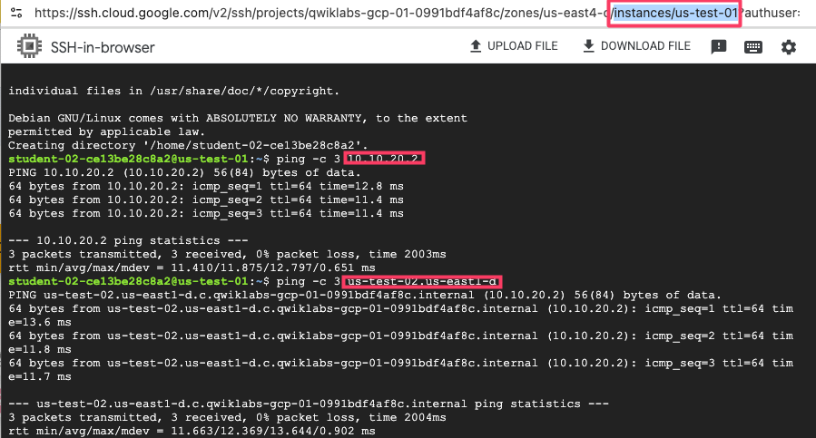

# Week 2 Summary - Google Cloud Network

## Set Up a Google Cloud Network
- Google Cloud에서 사용자 정의 네트워크를 생성하고, 서브넷과 방화벽 규칙을 추가한 후 VM을 생성하여 네트워크 통신 및 지연시간을 테스트하는 방법을 학습합니다.

---

## Goal 1: 사용자 정의 VPC 네트워크 구성

### 주요 학습 내용
- **VPC 네트워크 생성**
  - 사용자 정의 모드로 VPC 생성
  - 리전별 서브넷 구성 및 관리

- **서브넷 설계**
  - **서브넷 1**: `10.10.10.0/24` (us-weat-1)
  - **서브넷 2**: `10.10.20.0/24` (us-east-1)  

📚 [VPC 네트워크 개요](https://cloud.google.com/vpc/docs/vpc)  

---

## Goal 2: 방화벽 규칙 구성 및 보안 설정

### 방화벽 규칙 설정
- **SSH 접근 허용**
  - 소스: `0.0.0.0/0` (모든 IP)
  - 프로토콜: `TCP/22`
  - 용도: 원격 관리 및 접속

- **RDP 접근 허용**  
  - 소스: `0.0.0.0/0` (모든 IP)
  - 프로토콜: `TCP/3389`
  - 용도: Windows VM 원격 데스크톱 연결

- **내부 통신 허용**
  - 소스: `10.10.10.0/24`, `10.10.20.0/24`
  - 프로토콜: `ICMP`
  - 용도: 서브넷 간 ping 테스트 및 네트워크 진단

### 보안 모범 사례
- **최소 권한 원칙**: 필요한 포트만 개방
- **소스 IP 제한**: 가능한 경우 특정 IP 대역으로 제한
- **태그 기반 규칙**: VM 태그를 활용한 세밀한 제어

📚 [방화벽 규칙 구성](https://cloud.google.com/firewall/docs/firewalls)

---

## Goal 3: VM 인스턴스 생성 및 네트워크 통신 테스트

### VM 인스턴스 배포
- **VM 1**: `us-test-01` (첫 번째 서브넷)
- **VM 2**: `us-test-02` (두 번째 서브넷)
- 각각 다른 리전의 서브넷에 배치하여 네트워크 연결성 검증


*VM 인스턴스 네트워킹 구성 화면*

### 네트워크 연결성 테스트
```bash
# 내부 DNS를 통한 ping 테스트
ping -c 3 us-test-02.<subnet-zone>

# IP 주소를 통한 직접 통신 테스트
ping -c 3 10.10.20.2
```

📚 [VM 인스턴스 연결](https://cloud.google.com/compute/docs/instances/connecting-to-instance)

---

## 내부 DNS 시스템

### 내부 DNS 자동 관리
- **자동 DNS 레코드 생성**: VM 생성 시 DNS 항목 자동 등록
- **동적 업데이트**: 인스턴스 상태 변경 시 DNS 자동 갱신
- **자동 정리**: VM 삭제 시 DNS 레코드 자동 제거

### 내부 DNS 명명 규칙
1. **영역 DNS (Zonal DNS)**
   - 형식: `INSTANCE_NAME.ZONE.c.PROJECT_ID.internal`
   - 용도: 특정 영역 내 인스턴스 식별
   - 예시: `us-test-01.us-central1-a.c.my-project.internal`

2. **전역 DNS (Global DNS)**
   - 형식: `INSTANCE_NAME.c.PROJECT_ID.internal`
   - 용도: 프로젝트 전체에서 인스턴스 식별
   - 예시: `us-test-01.c.my-project.internal`

### DNS 활용 장점
- **인스턴스 이름 재사용**: 여러 영역에서 동일한 이름 사용 가능
- **IP 주소 추상화**: 하드코딩된 IP 주소 의존성 제거
- **자동 서비스 디스커버리**: 동적 환경에서의 서비스 검색

📚 [내부 DNS 개요](https://cloud.google.com/compute/docs/internal-dns?hl=ko)  
📚 [내부 DNS 사용법](https://cloud.google.com/compute/docs/networking/using-internal-dns?hl=ko)

---

## 학습 성과 배지


*Google Cloud Network 과정 완료 배지*

---

## 참고 자료
- [VPC 네트워크 문서](https://cloud.google.com/vpc/docs)
- [방화벽 규칙 가이드](https://cloud.google.com/firewall/docs)
- [Compute Engine 네트워킹](https://cloud.google.com/compute/docs/networking)
- [내부 DNS 구성](https://cloud.google.com/compute/docs/internal-dns?hl=ko)
- [네트워크 보안 모범 사례](https://cloud.google.com/security/best-practices)
