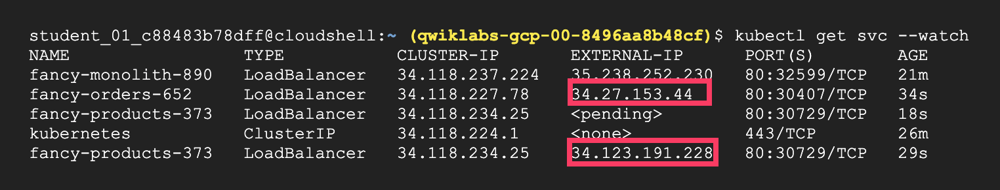
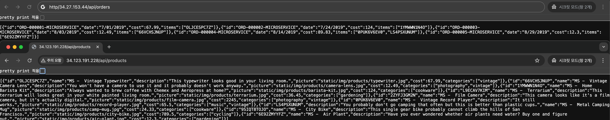

# Week 3 Summary - Build a Website on Google Cloud

## Build a Website on Google Cloud
- https://www.cloudskillsboost.google/course_templates/638
- Cloud Run에서 웹사이트 배포, Compute Engine에서 웹 앱 호스팅, Google Kubernetes Engine에서 웹사이트 생성/배포/확장, Cloud Build를 사용하여 모놀리식 애플리케이션을 마이크로서비스 아키텍처로 마이그레이션하는 방법을 학습합니다.

---

## Goal 1: Setting up Container Registry and Cloud Build

### 주요 학습 내용
- **Docker 이미지 빌드 및 푸시**
  - 로컬 Docker 이미지를 Google Cloud로 업로드
  - Container Registry와 Artifact Registry 활용

- **필수 서비스 활성화**
```bash
# Docker 인증 설정
gcloud auth configure-docker Region-docker.pkg.dev

# 필요한 API 서비스 활성화
gcloud services enable artifactregistry.googleapis.com \
    cloudbuild.googleapis.com \
    run.googleapis.com
```


⚠️ **Container Registry → Artifact Registry 마이그레이션**
- Container Registry는 지원 중단되었습니다. 2025년 3월 18일부터 Container Registry가 종료되어 Container Registry에 이미지를 쓸 수 없습니다.  
- Artifact Registry는 컨테이너 이미지 및 비컨테이너 아티팩트를 모두 지원하는 완전 관리형 서비스로서 Container Registry의 기능을 확장합니다.  
-> [Container Registry에서 전환](https://cloud.google.com/artifact-registry/docs/transition/transition-from-gcr?hl=ko)
---


#### Cloud Run
- container 이미지로 인스턴스를 만들어서 관리하는 방식.
- aws lambda과 달리 클라우드에서 지원하는 런타임에 의존하지 않기 때문에 독립적으로 관리 가능(업데이트 번거로움이 없어보임).

[Cloud Run 소개 문서](https://cloud.google.com/run/docs/overview/what-is-cloud-run?hl=ko)

## Goal 2: Automated Build with Cloud Build

### Cloud Build 활용
- **자동화된 이미지 빌드**
  - 소스 코드에서 Docker 이미지 자동 생성
  - CI/CD 파이프라인 구축

```bash
# Cloud Build를 통한 이미지 빌드 및 푸시
gcloud builds submit --tag gcr.io/${GOOGLE_CLOUD_PROJECT}/fancy-monolith-890:1.0.0
```

### 빌드 프로세스
- **소스 코드 업로드**: Cloud Storage에 소스 코드 임시 저장
- **Docker 이미지 빌드**: Cloud Build 환경에서 이미지 생성
- **레지스트리 푸시**: 완성된 이미지를 Container Registry에 저장

### Cloud Build 
- `cloudbuild.yaml` 파일을 통해 자세한 커스텀 가능
  - 빌드 커맨드 등 CI 프로세스 관리

📚 [Cloud Build 가이드](https://cloud.google.com/build/docs)

---

## Goal 3: Configuring Google Kubernetes Engine (GKE) Cluster

### GKE 클러스터 생성
```bash
# 기본 영역 설정
gcloud config set compute/zone us-central1-a

# GKE 클러스터 생성 (3개 노드)
gcloud container clusters create fancy-prod-631 --num-nodes 3
```

📚 [GKE 클러스터 생성](https://cloud.google.com/kubernetes-engine/docs/how-to/creating-a-zonal-cluster)

---

## Goal 4: Deploying Applications and Exposing Services on Kubernetes

### 애플리케이션 배포
```bash
# Deployment 생성
kubectl create deployment fancy-monolith-890 \
  --image=gcr.io/${GOOGLE_CLOUD_PROJECT}/fancy-monolith-890:1.0.0

# LoadBalancer 서비스로 외부 노출
kubectl expose deployment fancy-frontend-375 \
  --type=LoadBalancer \
  --port 80 \
  --target-port 8080
```

### Kubernetes 리소스 구성
- **Deployment**: 애플리케이션 파드 관리 및 복제
- **Service**: 네트워크 접근 및 로드 밸런싱
- **LoadBalancer**: 외부 트래픽을 클러스터 내부로 라우팅

### 서비스 타입별 특징
- **ClusterIP**: 클러스터 내부 통신만 허용
- **NodePort**: 노드의 특정 포트로 외부 접근
- **LoadBalancer**: 클라우드 로드 밸런서 자동 생성

## Results


*Kubernetes 서비스 외부 IP 할당 화면*


*마이크로서비스 API 호출 결과*


*완성된 웹사이트 홈페이지*

---

## 학습 성과 배지


*Build a Website on Google Cloud 과정 완료 배지*

---

## 참고 자료
