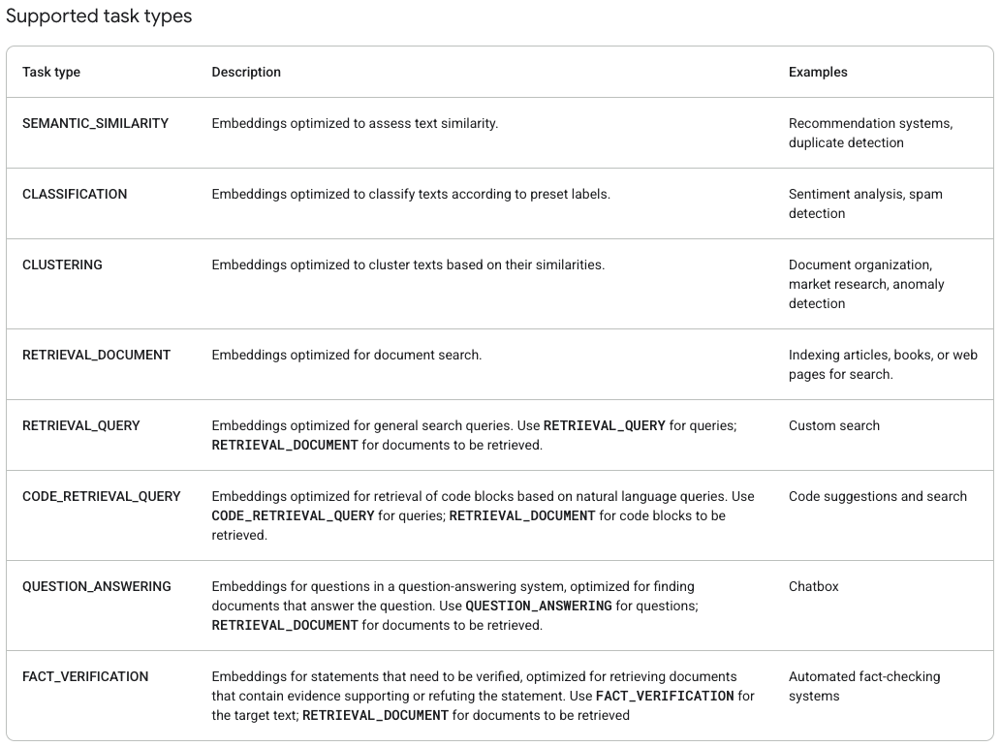
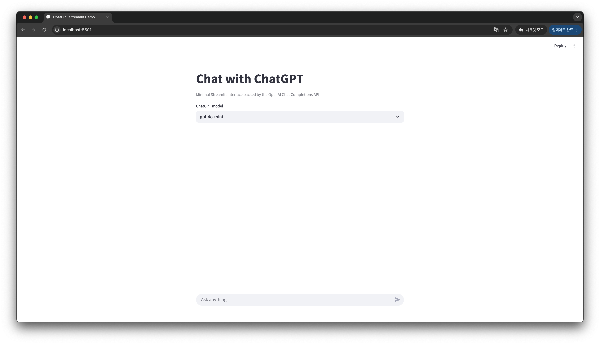
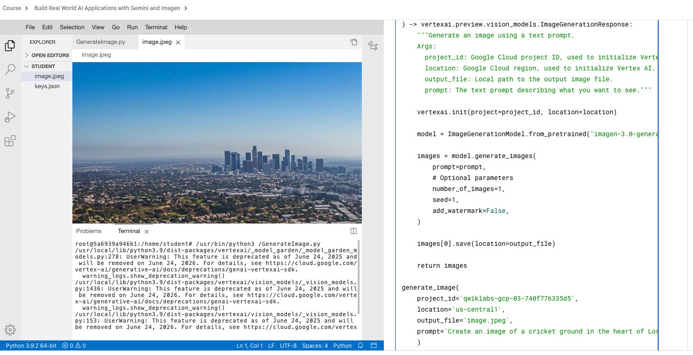
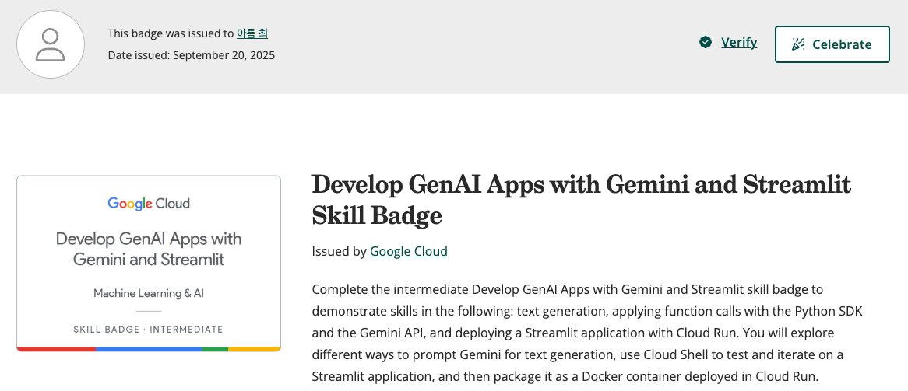

# Week 4 Summary - GenAI

## Develop GenAI Apps with Gemini and Streamlit
- https://www.cloudskillsboost.google/course_templates/978
- Gemini API를 활용한 GenAI 애플리케이션 개발, Streamlit으로 인터랙티브 앱 구축

---

## 1. Gemini API 설정 및 SDK 활용

### 주요 학습 내용
- **Gemini API 키 설정**
  - Google Cloud 프로젝트와 API 키 연동

📚 [Gemini API 키 관리](https://ai.google.dev/gemini-api/docs/api-key?hl=ko)
📚 [Google Gen AI SDK 문서](https://googleapis.github.io/python-genai/)

---

## 2. Google AI 모델 이해 및 활용

### 1. Gemini
- **입력**: Text, Code, Images, Audio, Video
- **출력**: Text
- **활용**: 멀티모달 텍스트 생성, 코드 생성, 이미지 분석
#### 2. Imagen
- **입력**: Text, Images
- **출력**: Images
- **활용**: 텍스트-이미지 생성, 이미지 편집
- **실습**: [Imagen Lab](https://www.cloudskillsboost.google/course_templates/1076/labs/584319)

### 3. Veo
- **입력**: Text, Images
- **출력**: Video
- **활용**: 비디오 생성 및 편집

### 4. Embedding
- **입력**: Text
- **출력**: dense vector
- **활용**: 의미적 유사도 검색, RAG 시스템 구성요소
    - **RAG에서 역할**: 문서 인덱싱(저장), 의미 기반 검색 및 정확도 향상
- **실습**: [Embedding Lab](https://www.cloudskillsboost.google/focuses/104682?catalog_rank=%7B%22rank%22%3A14%2C%22num_filters%22%3A0%2C%22has_search%22%3Atrue%7D&parent=catalog&search_id=54173603)

---

## 3. Multimodal RAG (Retrieval-Augmented Generation)

### RAG 시스템 작동 원리
1. **사용자 질의 처리**
   - 입력 쿼리를 embedding 모델로 벡터화
   - 기존 임베딩 벡터와 유사도 계산

2. **관련 컨텍스트 수집**
    - Vector DB에서 임베딩 기반 유사 콘텐츠 탐색
    - 텍스트 청크 및 이미지 검색
    - Top-k 개의 가장 관련성 높은 문서 선별

3. **컨텍스트 생성**
   - 수집된 정보를 구조화된 컨텍스트로 변환
   - 멀티모달 데이터 통합

4. **응답 생성**
   - Instructions + Retrieved Context + User Query 결합
   - Gemini 모델을 통한 최종 답변 생성

### RAG의 핵심 가치
- **의미 기반 검색**: Embedding을 통한 키워드 매칭을 넘어선 의미적 유사도 검색
- **정확도 향상**: 외부 지식 베이스와 모델 지식의 결합으로 hallucination 감소
- **실시간 정보**: 최신 데이터를 활용한 응답 생성
- **확장성**: Vector DB를 통한 대용량 문서에서의 빠른 검색

---

## Goal 4: Streamlit을 활용한 GenAI 앱 배포

### Streamlit 애플리케이션 개발
- **인터랙티브 UI**: 사용자 친화적인 웹 인터페이스 구성
- **실시간 상호작용**: Gemini API와의 실시간 통신
- **멀티모달 지원**: 텍스트, 이미지, 오디오 입력 처리

---

## Results

*Imagen 모델을 활용한 이미지 생성 결과*

---

## 학습 성과 배지

*Develop GenAI Apps with Gemini and Streamlit 과정 완료 배지*

---

## 참고 자료

### 샘플 코드 및 튜토리얼
- [Streamlit 앱 샘플 코드](https://github.com/GoogleCloudPlatform/generative-ai/blob/main/gemini/sample-apps/gemini-streamlit-cloudrun/app.py)
- [Multimodal RAG VertexAI 구현 예제](https://github.com/GoogleCloudPlatform/generative-ai/blob/main/gemini/use-cases/retrieval-augmented-generation/intro_multimodal_rag.ipynb)

### 공식 문서
- [Gemini API 문서](https://ai.google.dev/gemini-api/docs/api-key?hl=ko)
- [Google Gen AI SDK](https://googleapis.github.io/python-genai/)
- [Vertex AI 문서](https://cloud.google.com/vertex-ai/docs)